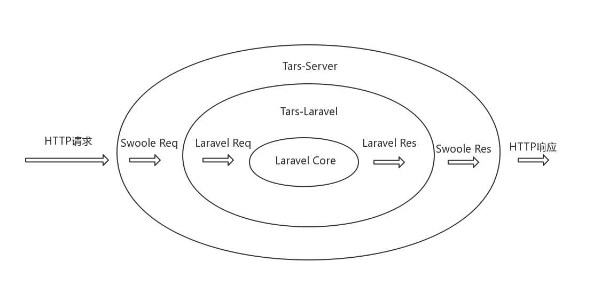

# TarsPHP与主流框架的结合

随着TarsPHP的发布，PHP语言也拥有了包含开发、运维、以及测试的一整套微服务解决方案。但是在实际的应用中，
还是需要考虑与现有技术栈的融合。如果是新开发的微服务，必须集成路由、ORM、日志等辅助类库。而对于已经存在的服务，
重新开发的成本也比较高。如果TarsPHP能够实现与主流框架的集成，会大大降低开发成本，帮助PHP开发者更快速地接入Tars
的基础能力。

## TarsPHP集成主流框架的思路

TarsPHP的服务容器是基于Swoole的能力实现的，并且利用Swoole的Task进程实现主调和监控上报等功能。因此，
TarsPHP与框架的结合的重点就是Swoole和框架的结合，把Swoole的上下文转换成框架的上下文，结合Swoole的http服务
能力和框架的路由、控制器等功能。除此之外，还需要对接TarsPHP的入口文件、配置下发、日志服务等功能。

### 基于TarsPHP组件，包括tars-server、tars-log、tars-monitor、tars-registry等

复用TarsPHP的组件，不需要重复实现tars的基础能力，减少开发量，避免重复踩坑，重点关注框架的适配问题。

Laravel: 
```php
//把TarsPHP入口脚本的参数转换成Laravel的Command参数
$_SERVER['argv'][0] = $argv[0] = __DIR__ .'/artisan';
$_SERVER['argv'][1] = $argv[1] = 'tars:entry';
$_SERVER['argv'][2] = $argv[2] = '--cmd=' . $cmd;
$_SERVER['argv'][3] = $argv[3] = '--config_path=' . $config_path;
$_SERVER['argc'] = $argc = count($_SERVER['argv']);

//执行Laravel的Command
include_once __DIR__ . '/artisan';
```

```php
//在Laravel的Command脚本里接收TarsPHP启动脚本传入的cmd和config路径，启动tars-server中的TarsCommand
public function handle()
{
    $cmd = $this->option('cmd');
    $cfg = $this->option('config_path');

    $class = new TarsCommand($cmd, $cfg);
    $class->run();
}
```

Yii2: 
```php
//把TarsPHP入口脚本的参数转换成Yii2的Command参数
$_SERVER['argv'][0] = $argv[0] = 'yii';
$_SERVER['argv'][1] = $argv[1] = 'tars/entry';
$_SERVER['argv'][2] = $argv[2] = $cmd;
$_SERVER['argv'][3] = $argv[3] = $config_path;
$_SERVER['argc'] = $argc = count($_SERVER['argv']);

//执行Yii2的Command
include_once __DIR__ . '/yii';
```

```php
//在Yii2的Command脚本里接收TarsPHP启动脚本传入的cmd和config路径，启动tars-server中的TarsCommand
public function actionEntry($cmd, $cfg)
{
    $class = new TarsCommand($cmd, $cfg);
    $class->run();
}
```

### 请求和响应的上下文转换



在TarsController里，把TarsRequest对象转换成框架的Request对象，然后通过框架的app内核分发
请求，通过框架的路由最后到达框架的控制器层。控制器返回框架的Response对象，在TarsController中，通过框架
的Response对象获取HTTP响应头和body，再通过TarsResponse对象将响应头和body发送给客户端。

请求上下文的转换: 

Laravel: 
```php
/**
 * 根据请求上下文参数生成Laravel的Request对象
 *
 * @param array $get
 * @param array $post
 * @param array $cookie
 * @param array $files
 * @param array $server
 * @param string $content
 * @return \Illuminate\Http\Request
 * @throws \LogicException
 */
protected function createIlluminateRequest($get, $post, $cookie, $files, $server, $content = null)
{
    IlluminateRequest::enableHttpMethodParameterOverride();

    /*
    |--------------------------------------------------------------------------
    | Copy from \Symfony\Component\HttpFoundation\Request::createFromGlobals().
    |--------------------------------------------------------------------------
    |
    | With the php's bug #66606, the php's built-in web server
    | stores the Content-Type and Content-Length header values in
    | HTTP_CONTENT_TYPE and HTTP_CONTENT_LENGTH fields.
    |
    */

    if ('cli-server' === PHP_SAPI) {
        if (array_key_exists('HTTP_CONTENT_LENGTH', $server)) {
            $server['CONTENT_LENGTH'] = $server['HTTP_CONTENT_LENGTH'];
        }
        if (array_key_exists('HTTP_CONTENT_TYPE', $server)) {
            $server['CONTENT_TYPE'] = $server['HTTP_CONTENT_TYPE'];
        }
    }

    $request = new SymfonyRequest($get, $post, [], $cookie, $files, $server, $content);

    if (0 === strpos($request->headers->get('CONTENT_TYPE'), 'application/x-www-form-urlencoded')
        && in_array(strtoupper($request->server->get('REQUEST_METHOD', 'GET')), array('PUT', 'DELETE', 'PATCH'))
    ) {
        parse_str($request->getContent(), $data);
        $request->request = new ParameterBag($data);
    }

    $this->illuminateRequest = IlluminateRequest::createFromBase($request);
}
```

Yii2: 
```php
/**
 * 继承Yii2的Request，替换原生的方法，通过tarsRequest获取请求上下文
 *
 * @package Lxj\Yii2\Tars
 */
class Yii2Request extends \yii\web\Request
{
    /**
     * @var \Tars\core\Request
     */
    public $tarsRequest;

    /**
     * @param \Tars\core\Request $request
     * @return $this
     */
    public function setTarsRequest(\Tars\core\Request $request)
    {
        $this->tarsRequest = $request;
        $this->clear();
        return $this;
    }

    /**
     * @return \Tars\core\Request
     */
    public function getTarsRequest()
    {
        return $this->tarsRequest;
    }
    
    /**
     * @inheritdoc
     */
    public function getQueryParams()
    {
        if ($this->_queryParams === null) {
            $tarsRequest = $this->getTarsRequest();
            $this->_queryParams = isset($tarsRequest->data['get']) ? $tarsRequest->data['get'] : [];
        }
        return $this->_queryParams;
    }
    ...
}
```

框架的请求分发和路由: 

Laravel: 
```php
/** @var Kernel $kernel */
$kernel = $application->make(Kernel::class);
$illuminateResponse = $kernel->handle($illuminateRequest);
```

Yii2: 
```php
$application->set('request', $yii2Request); //注入request对象到app容器
$yii2Response = $application->handleRequest($yii2Request);
```

响应上下文的转换: 

Laravel: 
```php
//通过TarsResponse把Laravel的Response对象中的header和body返回给客户端

/**
 * Sends HTTP headers.
 *
 * @throws \InvalidArgumentException
 */
protected function sendHeaders()
{
    $illuminateResponse = $this->getIlluminateResponse();

    /* RFC2616 - 14.18 says all Responses need to have a Date */
    if (! $illuminateResponse->headers->has('Date')) {
        $illuminateResponse->setDate(\DateTime::createFromFormat('U', time()));
    }

    // headers
    foreach ($illuminateResponse->headers->allPreserveCaseWithoutCookies() as $name => $values) {
        foreach ($values as $value) {
            $this->tarsResponse->header($name, $value);
        }
    }

    // status
    $this->tarsResponse->status($illuminateResponse->getStatusCode());

    // cookies
    foreach ($illuminateResponse->headers->getCookies() as $cookie) {
        $method = $cookie->isRaw() ? 'rawcookie' : 'cookie';

        $this->tarsResponse->resource->$method(
            $cookie->getName(), $cookie->getValue(),
            $cookie->getExpiresTime(), $cookie->getPath(),
            $cookie->getDomain(), $cookie->isSecure(),
            $cookie->isHttpOnly()
        );
    }
}

/**
 * Sends HTTP content.
 */
protected function sendContent()
{
    $illuminateResponse = $this->getIlluminateResponse();

    if ($illuminateResponse instanceof StreamedResponse) {
        $illuminateResponse->sendContent();
    } elseif ($illuminateResponse instanceof BinaryFileResponse) {
        $this->tarsResponse->resource->sendfile($illuminateResponse->getFile()->getPathname());
    } else {
        $this->tarsResponse->resource->end($illuminateResponse->getContent());
    }
}
```

Yii2: 
```php
//通过TarsResponse把Yii2的Response对象中的header和body返回给客户端

/**
 * Sends HTTP headers.
 *
 * @throws \InvalidArgumentException
 */
protected function sendHeaders()
{
    $yii2Response = $this->getYii2Response();

    /* RFC2616 - 14.18 says all Responses need to have a Date */
    if (! $yii2Response->headers->has('Date')) {
        $yii2Response->headers->set('Date', \DateTime::createFromFormat('U', time()));
    }

    // headers
    foreach ($yii2Response->headers->getIterator() as $name => $values) {
        foreach ($values as $value) {
            $this->tarsResponse->header($name, $value);
        }
    }

    // status
    $this->tarsResponse->status($yii2Response->getStatusCode());
}

/**
 * Sends HTTP content.
 */
protected function sendContent()
{
    $yii2Response = $this->getYii2Response();

    $this->tarsResponse->resource->end($yii2Response->content);
}
```

### 下发Tars-Config配置到框架

通过TarsLog组件调用接口获取到远程配置，合并到框架自带的配置项中。在Laravel中，可以直接把配置写入到Config对象
中。在Yii2中，不支持直接修改Config，可以把远程配置合并到全局的params参数中。

```php
//拉取TarsConfig配置项
$communicatorConfig = self::communicatorConfig($deployConfigPath);
$configServant = new \Tars\config\ConfigServant($communicatorConfig);
$configServant->loadConfig($appName, $serverName, 'tars', $configtext);
```

Laravel: 
```php
//合并TarsConfig配置项到Laravel的Config对象
if ($configtext) {
    $remoteConfig = json_decode($configtext, true);
    foreach ($remoteConfig as $configName => $configValue) {
        app('config')->set($configName, array_merge(config($configName) ?: [], $configValue));
    }
}
```

Yii2: 
```php
//合并TarsConfig配置项到Yii2的params数组
if ($configtext) {
    $remoteConfig = json_decode($configtext, true);
    foreach ($remoteConfig as $configName => $configValue) {
        $app = Util::app();
        $localConfig = isset($app->params[$configName]) ? $app->params[$configName] : [];
        $app->params[$configName] = array_merge($localConfig, $configValue);
    }
}
```

### 集成Tars-Log到框架的日志组件中

tars-log组件自带了monolog handler，可以比较方便的集成到使用monolog作为日志引擎的框架，比如Laravel。
在没有使用monolog作为日志引擎的框架中，可以编写相应的handler来扩展日志输出的方式，比如Yii2 Log Target。

Laravel: 
```php
//实例化TarsLog自带的Monolog Handler
$communicatorConfig = Config::communicatorConfig($deployConfigPath);
$tarsLogHandler = new \Tars\log\handler\TarsHandler($communicatorConfig, 'tars.tarslog.LogObj', $level);

//Laravel Monolog实例注册Handler
$logger = app()->make('log');
$logger->driver()->pushHandler($tarsLogHandler);
```

Yii2: 
```php
//参考TarsLog的Handler实现了Yii2的Log Target
class LogTarget extends Target
{
    protected $app = 'Undefined';
    protected $server = 'Undefined';
    protected $dateFormat = '%Y%m%d';

    private $logServant;

    public $logConf;
    public $servantName = 'tars.tarslog.LogObj';

    public function init()
    {
        parent::init();

        $this->logServant = new LogServant($this->logConf, $this->servantName);

        $moduleName = $this->logConf->getModuleName();
        $moduleData = explode('.', $moduleName);
        $this->app = $moduleData ? $moduleData[0] : $this->app;
        $this->server = isset($moduleData[1]) ? $moduleData[1] : $this->server;
    }

    public function export()
    {
        $text = implode("\n", array_map([$this, 'formatMessage'], $this->messages)) . "\n";
        $this->logServant->logger($this->app, $this->server, '', $this->dateFormat, [$text]);
    }
}

//Yii2注册Log Target
$app->getLog()->getLogger()->dispatcher->targets['tars'] = \Yii::createObject([
    'class' => LogTarget::class,
    'logConf' => $config,
    'levels' => $level,
    'exportInterval' => $logInterval,
]);
```

### 主动释放框架和PHP的全局资源，防止内存泄漏

```php
//释放Stat Cache
clearstatcache();
```

Laravel: 
```php
//在Laravel框架中请求结束需要清除session、cookie等其他数据
if ($illuminateRequest->hasSession()) {
    $session = $illuminateRequest->getSession();
    if (is_callable([$session, 'clear'])) {
        $session->clear(); // @codeCoverageIgnore
    } else {
        $session->flush();
    }
}
...
```

Yii2: 
```php
//在Yii2框架中请求结束需要清除session和缓存的日志数据
if ($app->has('session', true)) {
    $app->getSession()->close();
}

if($app->state == -1){
    $app->getLog()->logger->flush(true);
}
```

### 参考主流框架与Swoole结合的开源项目

借鉴相对成熟的集成Swoole的开源项目，能够更快地实现上面所说的几点，并且避免一些其他的问题。
1. Laravool: [https://github.com/garveen/laravoole](https://github.com/garveen/laravoole)
2. Yii2-Swoole: [https://github.com/tsingsun/yii2-swoole](https://github.com/tsingsun/yii2-swoole)
3. 更多的项目可以查看Swoole官方文档: [https://wiki.swoole.com/wiki/page/p-framework.html](https://wiki.swoole.com/wiki/page/p-framework.html)

## 需要特别注意的几点
1. 在开发中需要预防内存泄漏。
2. 非协程框架不能使用协程。
3. 应用运行在PHP的cli模式下。

## 相关项目
1. TarsPHP: [https://github.com/TarsPHP/TarsPHP](https://github.com/TarsPHP/TarsPHP)
2. Tars-Laravel: [https://github.com/luoxiaojun1992/laravel-tars](https://github.com/luoxiaojun1992/laravel-tars)
3. Tars-Yii2: [https://github.com/luoxiaojun1992/yii2-tars](https://github.com/luoxiaojun1992/yii2-tars)

## 欢迎品尝和贡献代码
欢迎品尝TarsPHP、Tars-Laravel和Tars-Yii2，随手点个star，并通过提issue或PR的方式参与其中。
